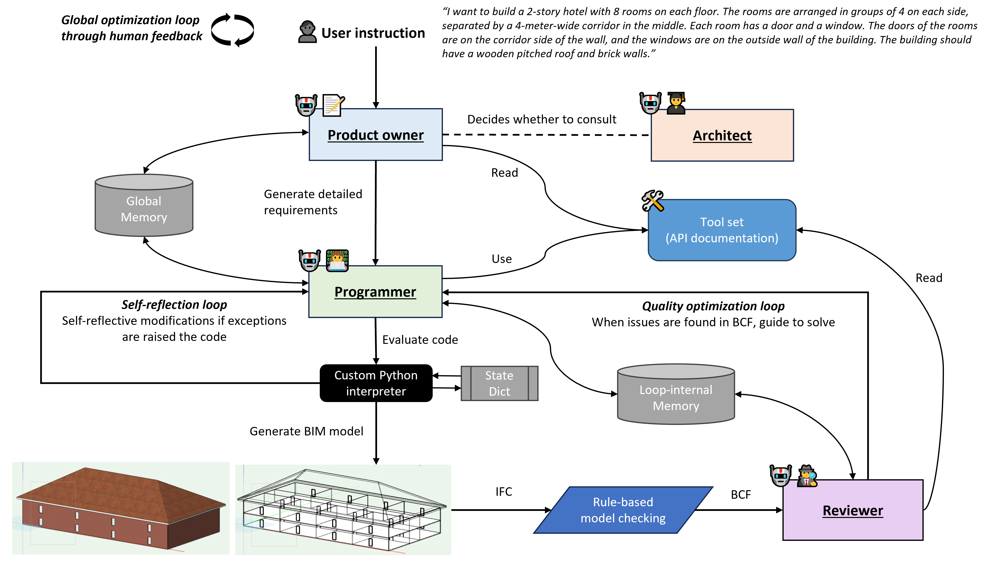

# Text2BIM: Generating Building Models Using a Large Language Model-based Multi-Agent Framework
This repo contains the implementation of the Text2BIM paper: 
https://www.arxiv.org/abs/2408.08054

>The conventional BIM authoring process typically requires designers to master complex and tedious modeling commands in order to materialize their design intentions within BIM authoring tools. This additional cognitive burden complicates the design process and hinders the adoption of BIM and model-based design in the AEC (Architecture, Engineering, and Construction) industry. To facilitate the expression of design intentions more intuitively, we propose Text2BIM, an LLM-based multi-agent framework that can generate 3D building models from natural language instructions. This framework orchestrates multiple LLM agents to collaborate and reason, transforming textual user input into imperative code that invokes the BIM authoring tool's APIs, thereby generating editable BIM models with internal layouts, external envelopes, and semantic information directly in the software. Furthermore, a rule-based model checker is introduced into the agentic workflow, utilizing predefined domain knowledge to guide the LLM agents in resolving issues within the generated models and iteratively improving model quality. Extensive experiments were conducted to compare and analyze the performance of three different LLMs under the proposed framework. The evaluation results demonstrate that our approach can effectively generate high-quality, structurally rational building models that are aligned with the abstract concepts specified by user input. Finally, an interactive software prototype was developed to integrate the framework into the BIM authoring software Vectorworks, showcasing the potential of modeling by chatting.



The `tool_agent` folder contains the Python implementation of the multi-agent framework. The `web_palette` folder contains the C++ plugin, which allows the framework to be used via the UI in Vectorworks. Please note that the `web_palette` folder is covered by a different license/agreement. All experiments are done in a Windows PC.

## Getting start
0. You need to have Vectorworks 2024 and Solibri Office installed in your PC (also need valid license to use both software).
1. Install packages in Vectorworks using powershell. Adapt to your own path.
    ```
    cd "C:\Program Files\Vectorworks 2024\Python39\Scripts"; 
    .\pip.exe install -r "C:\Users\xxx\Desktop\Text2BIM\requirements.txt" --no-cache-dir --target="C:\Users\xxx\AppData\Roaming\Nemetschek\Vectorworks\2024\Python Externals"
    ```
    Note: `IfcOpenshell` is downloaded from https://docs.ifcopenshell.org/ifcopenshell-python/installation.html. The pip has build error.
2. Add the project root path in Vectorworks's Tools>Plug-ins>Script Options so that it can be recognized.
3. Config your API keys and PROJECT_ROOT path in `tool_agent\agents.py` or `.env`.  Config the LLM model names/versions in `tool_agent\multi_agents_workflow.py` as well as in `tool_agent\agents.py` if needed.
4. Refer to `web_palette\README.md` for web palette setup. The plugin can be found in Windows>Palattes>Web Palettes>Text2BIM in Vectorworks.
5. Open `tool_agent\solibri_data\LLM-checking-FullExample.smc` using Solibri. You can right-click the sample model to update its path to the actual path in your computer, like `C:\Users\xxx\Desktop\Text2BIM\tool_agent\Ifc_test_data\sample_model.ifc`. Select "Automatic" mode in the pop-up window. Save the updated smc file and close it.
6. Run the prompts in the `test_prompt.txt` in `data\test_env_2024_new.vwx` to replicate the experiments in the paper. All experiments were done in June-July 2024, so if possible try to reproduce the experiments using the version of the LLM models available in this time period. For example, in our experiments we used the `gpt-4o-2024-05-13` version. We support `o1-preview` now!
7. When exporting IFC from Vectorworks, please save the IFC file under `tool_agent\Ifc_test_data`, make sure the name of the IFC file is the same as the name of the latest created prompt_(uuid..).txt in the same folder, so that Solibri can automatically load the IFC for checking.

## Config Gemini
We use Vertex AI SDK for Gemini setup, if you want to try Gemini.

1. Install gcloud cli https://cloud.google.com/sdk/docs/install?
2. Follow instruction to set up cloud project on vertex https://cloud.google.com/vertex-ai/generative-ai/docs/start/quickstarts/quickstart-multimodal
3. Install Vertex AI Python SDK https://cloud.google.com/vertex-ai/generative-ai/docs/reference/python/latest
    ```
    pip install google-cloud-aiplatform (should be already installed via requirements.txt)
    gcloud auth application-default login
    # may need to run, otherwise will frequently encounter 429 quota exceeded error: 
    gcloud auth application-default set-quota-project QUOTA_PROJECT_ID
    ```
4. Use `gemini-1.5-pro` instead of `gemini-1.5-pro-001`, the second one will give you 429 error!

## Hack fixes
1. In `C:\Users\xxx\AppData\Roaming\Nemetschek\Vectorworks\2024\Python Externals\mistralai\client.py`, you may need to increase time out to 500 to prevent error `Unexpected exception (ReadTimeout): The read operation timed out File mistralai\client.py", line 98, in _request raise MistralException(f"Unexpected exception ({e.__class__.__name__}): {e}") from e`

## Acknowledgement
The implementation is based on https://github.com/VectorworksDeveloper/SDKExamples and https://github.com/huggingface/transformers

## Citation
```
@misc{du2024text2bimgeneratingbuildingmodels,
      title={Text2BIM: Generating Building Models Using a Large Language Model-based Multi-Agent Framework}, 
      author={Changyu Du, Sebastian Esser, Stavros Nousias and André Borrmann},
      year={2024},
      eprint={2408.08054},
      archivePrefix={arXiv},
      primaryClass={cs.AI},
      url={https://arxiv.org/abs/2408.08054}, 
}
```
