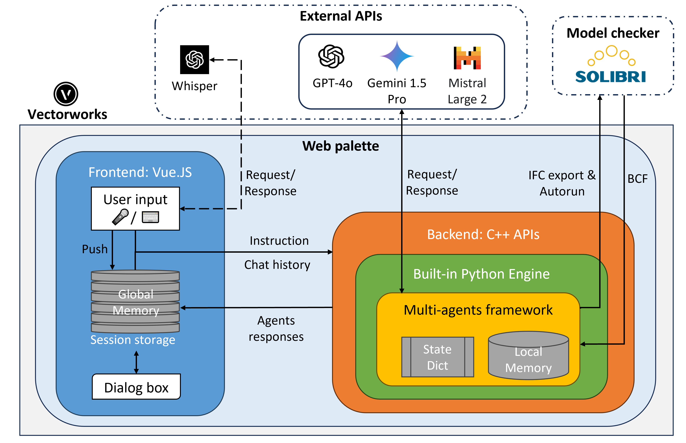

# Vectorworks Web Palette for Text2BIM

This folder contains the compiled Web Palette plugin. This plugin remains distributed in object form to comply with the Vectorworks SDK License Agreement. Use of this plugin ("Software") is contingent upon agreement to and compliance with the LICENSE and the following End User License Agreement (EULA).

```
End User License Agreement (EULA)

By downloading, accessing, or using the Software, you agree to be bound by the terms of this Agreement.

1. License Grant
The Licensor grants you a limited, non-exclusive, non-transferable, royalty-free license to use the Software in object code form, subject to the following conditions:

You may use the Software solely for lawful purposes and in compliance with this Agreement.
You may not copy, distribute, modify, or create derivative works of the Software, except as expressly permitted by this Agreement or applicable law.

2. Restrictions
You agree NOT to:
- Distribute, sell, sublicense, rent, loan, or lease the Software or any part thereof.
- Reverse engineer, decompile, disassemble, or otherwise attempt to discover the source code of the Software, except as permitted by applicable law.
- Use the Software to create derivative works or applications that bypass or replicate the functionality of the SDK or any Vectorworks Software.

3. Intellectual Property Rights
The Software, including all modifications, updates, and derivative works, remains the intellectual property of the Licensor. Any rights not expressly granted under this Agreement are reserved.

4. No Warranty
THE SOFTWARE IS PROVIDED "AS IS" WITHOUT WARRANTY OF ANY KIND, EXPRESS OR IMPLIED, INCLUDING BUT NOT LIMITED TO THE WARRANTIES OF MERCHANTABILITY, FITNESS FOR A PARTICULAR PURPOSE, AND NON-INFRINGEMENT.

5. Limitation of Liability
IN NO EVENT SHALL THE LICENSOR OR ITS SUPPLIERS BE LIABLE FOR ANY DAMAGES ARISING OUT OF OR RELATED TO THE USE OR INABILITY TO USE THE SOFTWARE, INCLUDING BUT NOT LIMITED TO INDIRECT, INCIDENTAL, SPECIAL, OR CONSEQUENTIAL DAMAGES, EVEN IF ADVISED OF THE POSSIBILITY OF SUCH DAMAGES.

6. Termination
This Agreement is effective until terminated. The Licensor may terminate this Agreement at any time if you breach any terms of this Agreement. Upon termination, you must cease all use of the Software and destroy any copies in your possession.

7. Export Compliance
You agree to comply with all applicable export laws and regulations, including those of the United States, in using the Software.

8. Governing Law
This Agreement shall be governed by and construed in accordance with the laws of the State of Maryland, USA, without regard to its conflict of laws principles.


By using the Software, you acknowledge that you have read, understood, and agreed to be bound by the terms of this EULA.
```

This plugin is developed based on https://github.com/VectorworksDeveloper/SDKExamples, check there for more details. Thanks Vlado for the hand-on tutorial!

## Getting started

Create a shortcut of folder `web_palette\Palette2024` or `web_palette\Palette2025`. Move it to `C:\Program Files\Vectorworks 2024\Plug-Ins` or `C:\Program Files\Vectorworks 2025\Plug-Ins`so that Vectorworks will automatically find the plugin at startup.

In Vectorworks 2024, the plugin can be found in `Windows>Palattes>Web Palettes>Text2BIM`.

In Vectorworks 2025, there was a significant change: web palettes are no longer automatically added under the Window menu. Instead, we will have a menu command, that can be added to the Workspace which will show our web-palette.
1. Add the Menu Command to Your Workspace:
Go to Tools > Workspaces > Edit Current Workspace
In the Workspace Editor, find `Text2BIM` (it should be under the AEC category).
Drag it to a menu where you want it to be placed in (e.g., AEC, Tools).
Click OK to save the workspace.

2. Once added to your workspace, you can open the palette by clicking the menu command you added.


